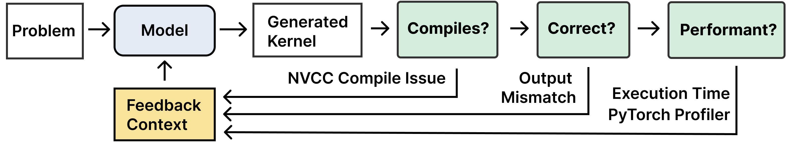

# Caesar - Multi-Turn Generations on KernelBench

Caesar is an orchestration framework for multi-turn generations on [KernelBench](https://github.com/ScalingIntelligence/KernelBench) [ICML'25].

> **Caesar**: APES TOGETHER STRONG!
> -- War for the Planet of the Apes (2017)

Designed by [@simonguozirui](https://github.com/simonguozirui) and [@alexzhang13](https://github.com/alexzhang13) for the [KernelBench paper](https://arxiv.org/abs/2502.10517), specifically Section `5.1.2`.

## Multi-Turn Generations
Kernel generation and optimization is inherently an **iterative** process: performance engineers write an implementation, check its correctness, and profiles its runtime (with tools) to find bottlenecks, and repeat this process over and over again.

Thus, it makes sense to scale test-time compute sequentially (iterative refinement). Caesar is designed to generate multi-turn trajectories in a batch / **high-throughput** setting.




Specifically, you could config the multi-turn execution to regenerate with 
- either just last turn and all previous turns' information
- with different amount of information, such as correctness, performance in raw runtime, profiling information, etc.

Concretely, caesar is designed as a state-machine (`state_machine.py`). You can define the sequence of transitions between states in `transitions_def.py`). Please feel free to modify and adapt to your setting.


## Usage 
Set up the same environment as [KernelBench](https://github.com/ScalingIntelligence/KernelBench), you will likely need KernelBench (to access problems and call functions in the package).

You would need at least one local GPU (managed by `GPUOrchestrator` object) to execute / evaluate GPU kernels. 

### Kick Caesar (Multi-Turn) Runs
```
cd caesar
python3 run_multi_turn.py {args...}
```

For example
```
python3 run_multi_turn.py max_k=10 level=2 dataset_name=KernelBench/level2 run_group=level2_eval_result_profiler_last_only_deepseek run_name=run_v0_deepseek_r1_turn .deepseek greedy_sample=True num_samples=1 mock=False verbose=False num_workers=48 num_gpus=8 use_subset=False --list context_strategy eval_result profiler list-- use_last_only=True model_name=deepseek-reasoner"
```
This specifies we run multi-turn generations, with turn budget of 10, each turn uses the information (eval result, pytorch profiler) from the previous turn. We also allocate a worker pool of 48 CPUs and 8 GPUs.

You can easily create a batch of commands with `create_caesar_run.py`. 

### Visualize Generations
We created an interface for you to easily check model generated kernel and its performance across turns.

Start the viewer through `python interface/viewer.py`.
For convenience, use `w` and `s` to navigate through the problems.

You need to port forward to see the interface on your local machine.


### Tool use / Feedback Signals
* NVCC Compiler
* Torch Profiler

Future Features
* NVIDIA nsight Profiler NCU (stretch goal)


## Structure to organize:
Experiment logs are saved on the disk, all under `<YOUR EXP ROOT DIRECTORY>/kernel_multi_turn`

They are organized as `run_name/problem_id/sample_id/`
* run group is a user defined name for a set of experiments: `level2_reflection_all_prev_deepseek`
* run name is a user defined name for experiment: `trial_level_1_deepseek_etc`
* problem_id is a logical index for the problem: `1, 2, ...`
    -> this should match the logical ID in the problem name
* sample_id is an index for the sample:  `0, 1, 2, ...`

Realistically we will have 
* 1 sample with 0 temperature sampling
* 10 samples with high temperature sampling

Inside each folder we have
```
- log.json
- DONE (empty object if it is done)
- config.json
```

### Example Traces
The trajectories generated for our experiments as shown in Section 5.1.2 of our paper could be found on [HuggingFace](https://huggingface.co/datasets/ScalingIntelligence/kernelbench-samples/tree/main/iterative_refinement).

## Future Directions
Make this a generic high-throughput engine for tasks that can iterate based on verifiable / execution reward, such as other code tasks, LEAN proof, etc.

For Software Engineering Domain (on SWE-Bench), check out the [CodeMonkeys](https://github.com/ScalingIntelligence/codemonkeys) which scales both parallel and sequential compute.
