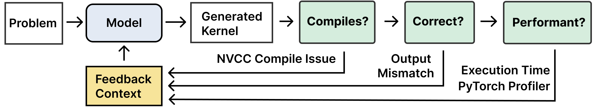

# Multi-step agentic code improvement

This is a fork of the original
[KernelBench](https://github.com/ScalingIntelligence/KernelBench) work
(submitted at ICML '25), which aimed to develop multi-iteration CUDA kernel
generation.

Instead, this fork aims to refine this into a more agentic framework, where an
LLM is directly responsible of dictating multi-turn multi-iteration improvements
as it sees fit.

The code was originally designed by
[@simonguozirui](https://github.com/simonguozirui) and
[@alexzhang13](https://github.com/alexzhang13) for the [KernelBench
paper](https://arxiv.org/abs/2502.10517), specifically Section `5.1.2`.

The basic idea of iterative refinements is to task an LLM with finding better
and better solutions, similarly to how a human engineer would.

Instead of multi-turn iteration, it may be beneficial for an LLM to directly
process the flow of input / output and signals from e.g. compiler, profiler etc.
to assess whether to refine a kernel, suggest a new kernel, or suggest a new
algorithm to tackle a problem altogether.

Although the code in the current repository focuses on CUDA kernel generation,
the framework should be general enough to apply to any problem that has
verifiable rewards and can be iteratively improved.
